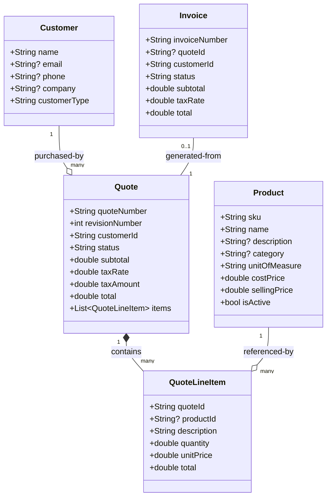
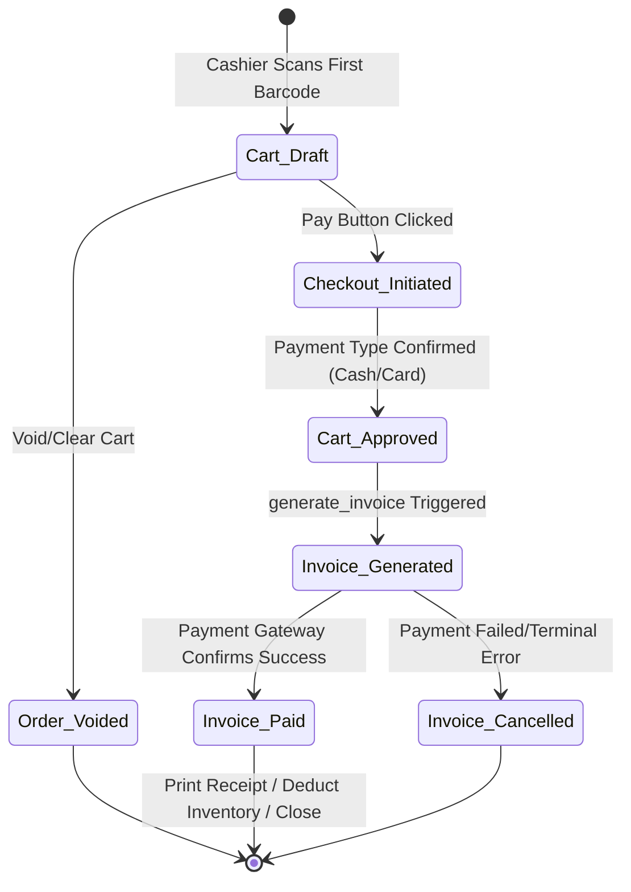

# ERP v1.0 — Master Offline-First POS Integration Blueprint
> [!NOTE]
> This master blueprint combines the complete **Sales & POS database schema mapping** and the **Modular Offline-First Plug-and-Play architecture** for your Flutter POS system.
> It provides database structures, auditing fields, business logic, state machines, plug-and-play contracts, sync engines, and ready-to-use **Dart / Flutter code** to construct a highly reliable, offline-capable, and infinitely extensible mobile/desktop checkout terminal.

---

## PART 1: The Modular Offline-First Architecture

To ensure your POS application remains clean and easily scalable, the app is organized into self-contained, feature-based **Modules**. Each module contains an internal `offline/` layer that handles database storage independently, a `connector/` layer for syncing with the backend, and UI screens. 

### A. Folder Organization
```text
lib/
├── core/                           # Application Shell (Core Framework)
│   ├── database/                   # Central SQLite/Drift/Hive Database Helpers
│   ├── network/                    # Central HTTP/Dio client & Connectivity checkers
│   ├── sync/                       # Global Sync Manager (runs all module sync tasks)
│   │   ├── sync_engine.dart
│   │   └── sync_task.dart
│   ├── navigation/                 # Global shell layout & routing
│   └── registry/                   # Central bootstrapper registry
│       ├── core_registry.dart
│       └── pos_module.dart         # Base contract for plug-and-play modules
│
└── modules/                        # Business Modules Directory
    ├── sales/                      # Sales Module (Core POS Checkout)
    │   ├── offline/                # SQLite/Drift Tables, Local Quote & Cart repositories
    │   ├── connector/              # Translates local sales to ERP Quote/Invoice APIs
    │   ├── presentation/           # Checkout Cart UI, Receipts View, Cash Register UI
    │   ├── logic/                  # Cart BLoC / Controllers
    │   └── sales_module.dart       # Sales registration (Implements POSModule)
    │
    ├── inventory/                  # Product Catalog Module
    │   ├── offline/                # Offline SQLite Products table, low stock flags
    │   ├── connector/              # Pulls inventory catalog & pricing from ERP server
    │   └── inventory_module.dart   # Inventory registration
    │
    └── crm/                        # Customer Registry Module
        ├── offline/                # Offline Walk-in / Customer directories
        ├── connector/              # Syncs customer cards & phone directories
        └── crm_module.dart         # CRM registration
```

---

## PART 2: Core Database Mappings & Audit Fields

Every data table in the backend ERP v1.0 inherits from a unified base class `ERPModel`. To make sure your local offline SQLite, Hive, or Drift tables sync cleanly with the backend without collision, your Dart base models must support these audit, tenant-level, and optimistic-locking fields.

### ERP Base Columns to Dart Mappings
| Column Name | Database Type | Dart Type | Primary Function |
| :--- | :--- | :--- | :--- |
| `id` | `UUID v4` (Primary Key) | `String` | Unique ID. Generated client-side via UUID v4 to prevent duplicate key collisions. |
| `tenant_id` | `UUID` (Foreign Key) | `String` | Row-level multi-tenant isolation key (crucial for multi-store SaaS). |
| `created_at` | `DateTime` (UTC) | `DateTime` | Timestamp when the record was initiated. |
| `updated_at` | `DateTime` (UTC) | `DateTime` | Timestamp of the last local/server update. |
| `created_by` | `UUID` (Nullable) | `String?` | ID of the cashier/user who created the record. |
| `updated_by` | `UUID` (Nullable) | `String?` | ID of the last user who edited the record. |
| `is_deleted` | `Boolean` | `bool` | Soft delete flag (default: `false`). Only query records where `is_deleted = false`. |
| `deleted_at` | `DateTime` (Nullable) | `DateTime?` | Soft delete timestamp. |
| `deleted_by` | `UUID` (Nullable) | `String?` | Cashier ID who soft-deleted the record. |
| `version_id` | `Integer` | `int` | Optimistic concurrency version lock (defaults to `1`, increments on every edit). |

---

## PART 3: POS Domain Model Specifications

Below are the blueprints of the five key modules representing the POS checkout pipeline.



### A. Product Schema (`inv_products`)
* **Sku** (`String(50)`, unique, indexed): The barcode string printed on the tag. Used to query products.
* **Name** (`String(255)`): Item display name.
* **Selling Price** (`Numeric(15, 2)`): Default checkout retail price.
* **Cost Price** (`Numeric(15, 2)`): Initial supply cost (useful for local profit margin calculation).
* **Is Active** (`bool`): Active flag. Inactive products are hidden from the cashier scanner.

### B. Customer Schema (`crm_customers`)
* **Name** (`String(255)`): Name or "Walk-in Customer".
* **Phone** (`String(20)?`): Contact number (crucial for lookup).
* **Customer Type** (`String(20)`): Defaults to `"prospect"`. Values: `"prospect"`, `"lead"`, `"customer"`, `"churned"`.

### C. Quote / Receipt Cart Schema (`sales_quotes`)
* **Quote Number** (`String(50)`, unique): Order number formatted as `QT-XXXXXXXX` (uppercase UUID subset).
* **Status** (`String(50)`): Order state. Values: `"draft"`, `"sent"`, `"approved"`, `"rejected"`, `"invoiced"`, `"cancelled"`.
* **Subtotal** (`Numeric(15, 2)`): Subtotal of items.
* **Tax Rate** (`Numeric(5, 2)`): Tax percentage (default: `10.0` for 10%).
* **Tax Amount** (`Numeric(15, 2)`): Calculated tax.
* **Total** (`Numeric(15, 2)`): Combined subtotal and tax.

### D. Quote Line Item (`sales_quote_line_items`)
* **Quote ID** (`UUID`): Parent receipt/cart session.
* **Product ID** (`UUID?`): Linked item ID (or Null for manual checkout entries).
* **Quantity** (`Numeric(10, 2)`): Quantity purchased.
* **Unit Price** (`Numeric(15, 2)`): Selling price at checkout.
* **Total** (`Numeric(15, 2)`): Auto-calculated `quantity * unitPrice`.

### E. Invoice / Completed Transaction (`sales_invoices`)
* **Invoice Number** (`String(50)`, unique): Receipt number formatted as `INV-XXXXXXXX`.
* **Status** (`String(50)`): Payment state. Values: `"draft"`, `"sent"`, `"paid"`, `"overdue"`, `"cancelled"`.
* **Total** (`Numeric(15, 2)`): Combined total paid.

---

## PART 4: POS Business Calculations & Naming Logic

To ensure the local Flutter client math matches the backend FastAPI database down to the penny:

### A. Core Mathematical Logic
1. **Item Line Calculation**:
   $$\text{Line Total} = \text{Quantity} \times \text{Unit Price}$$
2. **Cart Subtotal**:
   $$\text{Subtotal} = \sum (\text{Line Total})$$
3. **Tax Calculation**:
   $$\text{Tax Amount} = \text{Subtotal} \times \left( \frac{\text{Tax Rate}}{100.0} \right)$$
4. **Receipt Grand Total**:
   $$\text{Grand Total} = \text{Subtotal} + \text{Tax Amount}$$

### B. Dynamic Reference Generator
To generate human-readable order references offline and avoid server-side naming conflicts:

```dart
import 'package:uuid/uuid.dart';

String generateReferenceNumber(String prefix) {
  final uuidStr = const Uuid().v4().replaceAll('-', '').toUpperCase();
  return "$prefix-${uuidStr.substring(0, 8)}";
}
```

---

## PART 5: POS Checkout State Machine

The standard ERP sales flow is simplified for rapid transactions at physical terminals.



---

## PART 6: Comprehensive Dart & Flutter Code Implementation

Below are the base classes, plug-and-play interfaces, dynamic synchronization runners, and specific POS domain models compiled into a single file structure.

````carousel
```dart
// lib/core/registry/pos_module.dart
import 'package:flutter/widgets.dart';
import '../sync/sync_task.dart';

abstract class POSModule {
  String get moduleName;
  Future<void> initializeOffline();
  void registerDependencies();
  Map<String, WidgetBuilder> registerRoutes();
  List<SyncTask> getSyncTasks();
}

// lib/core/sync/sync_task.dart
abstract class SyncTask {
  String get taskName;
  Future<bool> hasPendingData();
  Future<bool> executeSync();
}
```
<!-- slide -->
```dart
// lib/core/registry/core_registry.dart
import 'package:flutter/foundation.dart';
import 'pos_module.dart';

class POSCoreRegistry {
  POSCoreRegistry._();
  static final List<POSModule> _registeredModules = [];
  static List<POSModule> get modules => List.unmodifiable(_registeredModules);

  static Future<void> initialize(List<POSModule> activeModules) async {
    for (var module in activeModules) {
      if (kDebugMode) print('🔌 Connecting Module: [${module.moduleName.toUpperCase()}]...');
      await module.initializeOffline();
      module.registerDependencies();
      _registeredModules.add(module);
    }
  }

  static Map<String, WidgetBuilder> getGlobalRoutes() {
    final Map<String, WidgetBuilder> globalRoutes = {};
    for (var module in _registeredModules) {
      globalRoutes.addAll(module.registerRoutes());
    }
    return globalRoutes;
  }
}
```
<!-- slide -->
```dart
// lib/core/sync/sync_engine.dart
import 'dart:async';
import 'package:flutter/foundation.dart';
import '../registry/core_registry.dart';
import 'sync_task.dart';

class POSSyncEngine {
  Timer? _syncTimer;
  bool _isSyncing = false;

  void startPeriodicSync(Duration interval) {
    _syncTimer?.cancel();
    _syncTimer = Timer.periodic(interval, (_) => triggerSync());
  }

  void stopSync() {
    _syncTimer?.cancel();
  }

  Future<void> triggerSync() async {
    if (_isSyncing) return;
    _isSyncing = true;

    try {
      final bool isOnline = await _checkConnection();
      if (!isOnline) return;

      for (var module in POSCoreRegistry.modules) {
        final List<SyncTask> tasks = module.getSyncTasks();
        for (var task in tasks) {
          if (await task.hasPendingData()) {
            final success = await task.executeSync();
            if (success && kDebugMode) {
              print('✅ Synced Pending Data: [${task.taskName}]');
            }
          }
        }
      }
    } finally {
      _isSyncing = false;
    }
  }

  Future<bool> _checkConnection() async => true; // Ping endpoint helper
}
```
<!-- slide -->
```dart
// lib/core/models/base_model.dart
import 'package:uuid/uuid.dart';

abstract class ERPModel {
  final String id;
  final String tenantId;
  final DateTime createdAt;
  final DateTime updatedAt;
  final String? createdBy;
  final String? updatedBy;
  final bool isDeleted;
  final int versionId;

  ERPModel({
    String? id,
    required this.tenantId,
    DateTime? createdAt,
    DateTime? updatedAt,
    this.createdBy,
    this.updatedBy,
    this.isDeleted = false,
    this.versionId = 1,
  })  : id = id ?? const Uuid().v4(),
        createdAt = createdAt ?? DateTime.now().toUtc(),
        updatedAt = updatedAt ?? DateTime.now().toUtc();
}
```
<!-- slide -->
```dart
// lib/modules/sales/offline/models/product.dart
import '../../../../core/models/base_model.dart';

class Product extends ERPModel {
  final String sku;
  final String name;
  final String? description;
  final String? category;
  final String unitOfMeasure;
  final double costPrice;
  final double sellingPrice;
  final bool isActive;

  Product({
    super.id,
    required super.tenantId,
    super.createdAt,
    super.updatedAt,
    super.versionId,
    required this.sku,
    required this.name,
    this.description,
    this.category,
    this.unitOfMeasure = 'pcs',
    this.costPrice = 0.0,
    this.sellingPrice = 0.0,
    this.isActive = true,
  });

  factory Product.fromJson(Map<String, dynamic> json) {
    return Product(
      id: json['id'],
      tenantId: json['tenant_id'],
      createdAt: DateTime.parse(json['created_at']),
      updatedAt: DateTime.parse(json['updated_at']),
      versionId: json['version_id'] ?? 1,
      sku: json['sku'],
      name: json['name'],
      description: json['description'],
      category: json['category'],
      unitOfMeasure: json['unit_of_measure'] ?? 'pcs',
      costPrice: (json['cost_price'] as num).toDouble(),
      sellingPrice: (json['selling_price'] as num).toDouble(),
      isActive: json['is_active'] ?? true,
    );
  }

  Map<String, dynamic> toJson() => {
    'id': id,
    'tenant_id': tenantId,
    'sku': sku,
    'name': name,
    'description': description,
    'category': category,
    'unit_of_measure': unitOfMeasure,
    'cost_price': costPrice,
    'selling_price': sellingPrice,
    'is_active': isActive,
    'version_id': versionId,
  };
}
```
<!-- slide -->
```dart
// lib/modules/sales/offline/models/customer.dart
import '../../../../core/models/base_model.dart';

class Customer extends ERPModel {
  final String name;
  final String? email;
  final String? phone;
  final String? company;
  final String customerType;

  Customer({
    super.id,
    required super.tenantId,
    required this.name,
    this.email,
    this.phone,
    this.company,
    this.customerType = 'customer',
  });

  factory Customer.fromJson(Map<String, dynamic> json) {
    return Customer(
      id: json['id'],
      tenantId: json['tenant_id'],
      name: json['name'],
      email: json['email'],
      phone: json['phone'],
      company: json['company'],
      customerType: json['customer_type'] ?? 'customer',
    );
  }

  Map<String, dynamic> toJson() => {
    'id': id,
    'tenant_id': tenantId,
    'name': name,
    'email': email,
    'phone': phone,
    'company': company,
    'customer_type': customerType,
  };
}
```
<!-- slide -->
```dart
// lib/modules/sales/offline/models/quote_line_item.dart
import '../../../../core/models/base_model.dart';

class QuoteLineItem extends ERPModel {
  final String quoteId;
  final String? productId;
  final String description;
  final double quantity;
  final double unitPrice;
  final double total;

  QuoteLineItem({
    super.id,
    required super.tenantId,
    required this.quoteId,
    this.productId,
    required this.description,
    this.quantity = 1.0,
    this.unitPrice = 0.0,
    required this.total,
  });

  factory QuoteLineItem.createCartItem({
    required String tenantId,
    required String quoteId,
    String? productId,
    required String description,
    required double quantity,
    required double unitPrice,
  }) {
    return QuoteLineItem(
      tenantId: tenantId,
      quoteId: quoteId,
      productId: productId,
      description: description,
      quantity: quantity,
      unitPrice: unitPrice,
      total: quantity * unitPrice,
    );
  }

  factory QuoteLineItem.fromJson(Map<String, dynamic> json) {
    return QuoteLineItem(
      id: json['id'],
      tenantId: json['tenant_id'],
      quoteId: json['quote_id'],
      productId: json['product_id'],
      description: json['description'],
      quantity: (json['quantity'] as num).toDouble(),
      unitPrice: (json['unit_price'] as num).toDouble(),
      total: (json['total'] as num).toDouble(),
    );
  }

  Map<String, dynamic> toJson() => {
    'id': id,
    'tenant_id': tenantId,
    'quote_id': quoteId,
    'product_id': productId,
    'description': description,
    'quantity': quantity,
    'unit_price': unitPrice,
    'total': total,
  };
}
```
<!-- slide -->
```dart
// lib/modules/sales/offline/models/quote.dart
import 'package:uuid/uuid.dart';
import '../../../../core/models/base_model.dart';
import 'quote_line_item.dart';

class Quote extends ERPModel {
  final String quoteNumber;
  final int revisionNumber;
  final String customerId;
  final String status;
  final double subtotal;
  final double taxRate;
  final double taxAmount;
  final double total;
  final List<QuoteLineItem> items;

  Quote({
    super.id,
    required super.tenantId,
    required this.quoteNumber,
    this.revisionNumber = 1,
    required this.customerId,
    this.status = 'draft',
    required this.subtotal,
    this.taxRate = 10.0,
    required this.taxAmount,
    required this.total,
    required this.items,
  });

  factory Quote.buildNewQuote({
    required String tenantId,
    required String customerId,
    required List<QuoteLineItem> cartItems,
    double taxRate = 10.0,
  }) {
    final uuidHex = const Uuid().v4().replaceAll('-', '').toUpperCase();
    final quoteNo = "QT-${uuidHex.substring(0, 8)}";

    double calculatedSubtotal = cartItems.fold(0.0, (sum, item) => sum + item.total);
    double calculatedTax = calculatedSubtotal * (taxRate / 100.0);
    double calculatedTotal = calculatedSubtotal + calculatedTax;

    return Quote(
      tenantId: tenantId,
      quoteNumber: quoteNo,
      customerId: customerId,
      subtotal: calculatedSubtotal,
      taxRate: taxRate,
      taxAmount: calculatedTax,
      total: calculatedTotal,
      items: cartItems,
    );
  }

  factory Quote.fromJson(Map<String, dynamic> json) {
    return Quote(
      id: json['id'],
      tenantId: json['tenant_id'],
      quoteNumber: json['quote_number'],
      revisionNumber: json['revision_number'] ?? 1,
      customerId: json['customer_id'],
      status: json['status'] ?? 'draft',
      subtotal: (json['subtotal'] as num).toDouble(),
      taxRate: (json['tax_rate'] as num).toDouble(),
      taxAmount: (json['tax_amount'] as num).toDouble(),
      total: (json['total'] as num).toDouble(),
      items: (json['items'] as List?)
              ?.map((x) => QuoteLineItem.fromJson(x as Map<String, dynamic>))
              .toList() ?? [],
    );
  }

  Map<String, dynamic> toJson() => {
    'id': id,
    'tenant_id': tenantId,
    'quote_number': quoteNumber,
    'revision_number': revisionNumber,
    'customer_id': customerId,
    'status': status,
    'subtotal': subtotal,
    'tax_rate': taxRate,
    'tax_amount': taxAmount,
    'total': total,
    'items': items.map((x) => x.toJson()).toList(),
  };
}
```
````

---

## PART 7: Dynamic Synchronization Loop

### A. Offline-First Repository Queue
Below is the standard workflow template showing how a local transaction is queued to the SQLite table, and then marked as uploaded upon a successful API flush.

```dart
// lib/modules/sales/offline/sales_offline_repository.dart
import 'models/quote.dart';

class SalesOfflineRepository {
  // Local Database context references...

  Future<void> queueSaleLocally(Quote quote) async {
    // 1. Insert the quote model locally inside SQLite with a pending sync flag
    // e.g., db.insert('offline_quotes', quote.toJson(), isSynced: false);
  }

  Future<List<Quote>> getPendingSales() async {
    // 2. Fetch unsynced records
    // e.g., db.query('offline_quotes').where(isSynced == false)
    return [];
  }

  Future<void> markAsUploaded(String quoteId) async {
    // 3. Mark the transaction as uploaded once HTTP returns 201
    // e.g., db.update('offline_quotes').set(isSynced: true).where(id == quoteId);
  }
}
```

### B. Core Connector Task
The sync adapter matches local transactions to the central REST endpoints:

```dart
// lib/modules/sales/connector/sales_sync_task.dart
import '../../../core/sync/sync_task.dart';
import '../offline/sales_offline_repository.dart';

class SalesSyncTask implements SyncTask {
  final SalesOfflineRepository _localRepo;

  SalesSyncTask(this._localRepo);

  @override
  String get taskName => "sales_checkout_sync";

  @override
  Future<bool> hasPendingData() async {
    final pending = await _localRepo.getPendingSales();
    return pending.isNotEmpty;
  }

  @override
  Future<bool> executeSync() async {
    try {
      final pendingSales = await _localRepo.getPendingSales();
      for (var sale in pendingSales) {
        // HTTP POST request to API endpoint (e.g. POST /api/v1/sales/quotes)
        final bool isSuccess = await _postSaleToServer(sale);
        if (isSuccess) {
          await _localRepo.markAsUploaded(sale.id);
        }
      }
      return true;
    } catch (_) {
      return false;
    }
  }

  Future<bool> _postSaleToServer(dynamic sale) async {
    // API calling block with central HTTP client
    return true; 
  }
}
```

---

## PART 8: Developing & Adding a New Future Module (Plug-and-Play)

If you need to add a brand new feature in the future (e.g., a **Loyalty Points & Rewards Module**), follow this simple, standardized workflow inside its own folder, completely isolating it from existing code:


### Step 1: Create the isolated feature directory
Create a folder named `lib/modules/loyalty/`.

### Step 2: Implement the dynamic `POSModule` registration class
Create `loyalty_module.dart` inside your new directory:

```dart
// lib/modules/loyalty/loyalty_module.dart
import 'package:flutter/widgets.dart';
import '../../core/registry/pos_module.dart';
import '../../core/sync/sync_task.dart';

class LoyaltyModule implements POSModule {
  @override
  String get moduleName => "loyalty";

  @override
  Future<void> initializeOffline() async {
    // Open loyalty Hive boxes or run local SQLite table migrations
  }

  @override
  void registerDependencies() {
    // Inject local BLOCs, repositories or State Controllers
  }

  @override
  Map<String, WidgetBuilder> registerRoutes() {
    return {
      '/loyalty/balance': (context) => const Text("Customer Rewards Card Screen"),
    };
  }

  @override
  List<SyncTask> getSyncTasks() {
    return [
      // Register custom Loyalty Points Sync task here...
    ];
  }
}
```

### Step 3: Wire into the Application Registry
Open `main.dart`, import `loyalty_module.dart` and add it to the bootstrap list. The module will automatically configure its offline storage, navigation routes, dependency trees, and background upload syncs:

```dart
// lib/main.dart
void main() async {
  WidgetsFlutterBinding.ensureInitialized();

  await POSCoreRegistry.initialize([
    SalesModule(),
    InventoryModule(),
    CRMModule(),
    LoyaltyModule(), // Just drop in the new module! 
  ]);

  runApp(const MyApp());
}
```

---
